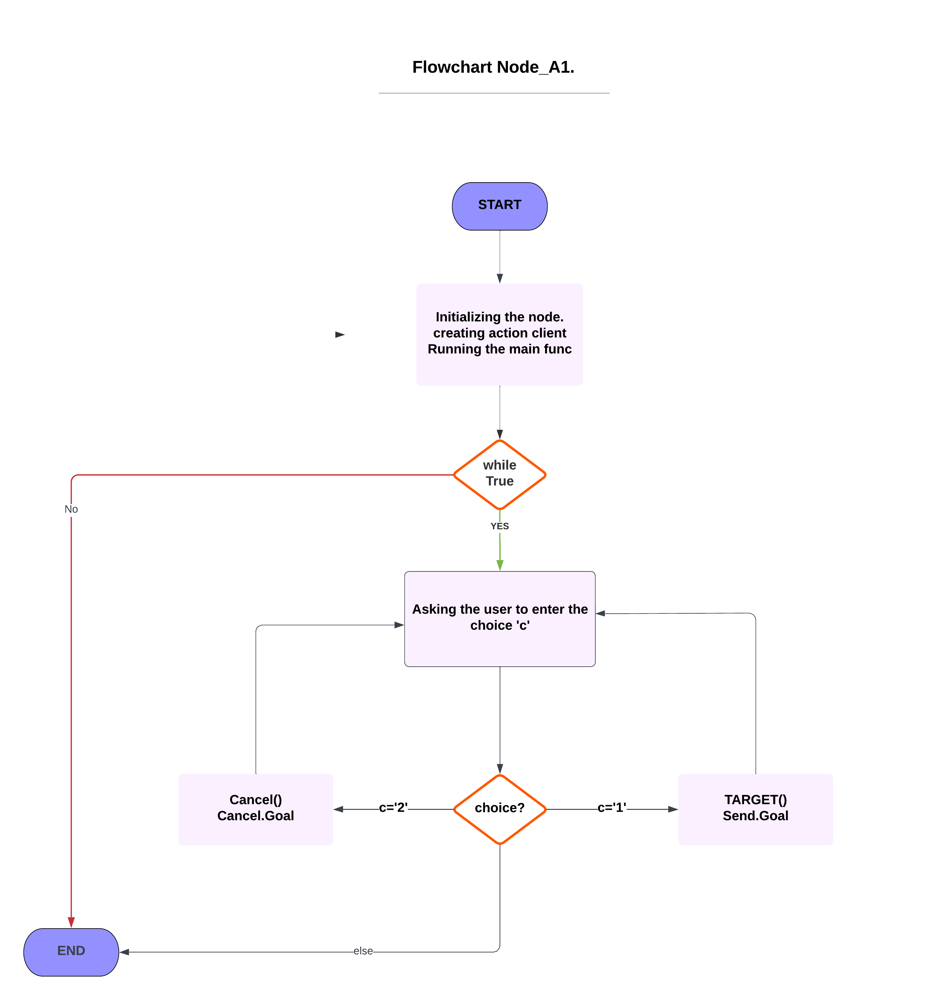

# Assignment 2 - RT1 ROS Nodes

## Overview
This repository contains the solution for the second assignment of the RT1 course. The assignment involved the creation of ROS nodes in C++ to perform specific tasks related to robot navigation and information retrieval.

## Nodes

### 1. Node_A1 (Action Client)
- Allows a user to input a target position for a robot to navigate to.
- Supports canceling the operation and reassigning a new target destination.
- Implemented using an action client.
- Publishes the robot's position and velocity as a custom message.
- Utilizes values from the `/odom` topic.

### 2. Node_B
- Publish the last target coordinates with service message
- Utilizes values from the `/goal` topic.

### 3. Node_C (Service Node)
- Subscribes to the robot’s position and velocity.
- Implements a server to retrieve the distance of the robot from the target and the robot’s average speed.

## Launch File
To streamline the simulation, a launch file has been added to the `assignment_2_2022` package. Running this launch file will start all the nodes simultaneously, providing a convenient way to initiate the entire simulation.

nodes
====

First of all I created the WorkSpace and in the /src file of the workspace I cloned the package Assignment_2_2023 and i inserted the two files in the same package 

These are some useful commands for running nodes and setting up the workspace.

To build the workspace, we use the command  `/catkin_make`

To run a node, we use the comand  rosrun ` <package_name> <node_name(executable)>`.

To launch a file , we use the comand  rolaunch `<package_name> <launch_file>`.

I created the c++ files for my nodes inside `/assignment_2_2023/src`:

Action Client node (node_A1):
-----------------------------
The action client node is responsible for allowing the user to set a target or cancel it. I implemeted it using the action client syntax. The code does the following:
This node imports various modules, including rocpp for ROS functionality, actionlib for creating the action client.

Defines the action_client function, which creates an action client that connects to an action server at the /reaching_goal topic. The function then enters a loop that ask the user to choose between three choices of sending target ,canceling it,or get the information about the robot if the user enter anything else than choices it exit.
The PseudoCode of the this node can be the following :
Define main function for setting and canceling the targets:
```
    creating and initializing node
    Initialize the client that send a goal to the action server.
    call main function
    While True:
        Ask the user to enter choice
        1. for sending goal
        2. for canceling!
        3-for getting information about position , state of robot
        If (choice = 1)
           Ask user to set target
           initializing the goal
           sendGoal
           send robot to desired target
        elseif (choice = 2)
            cancelGoal
        elseif (choice = 3)
            goalstatus
        else 
            exit the program.
```
and for implementing the publisher  and the subscriber  
```
# Step 1: Define a custom message type for position and velocity
class CustomPosVelMessage:
    float32 position_x
    float32 position_y
    float32 velocity_linear

# Step 2: Initialize the ROS node
ros_node.initialize("position_velocity_node")

# Step 3: Create a publisher for the custom_pos_vel topic
custom_pos_vel_publisher = ros_node.create_publisher(CustomPosVelMessage, 'custom_pos_vel', 10)

# Step 4: Define a callback function to handle incoming odom messages
def odom_callback(odom_message):
    # Step 5: Extract position and velocity information from the odom message
    robot_position_x = odom_message.position_x
    robot_position_y = odom_message.position_y
    robot_velocity_linear = odom_message.velocity_linear

    # Step 6: Create an instance of the custom message type
    custom_pos_vel_message = CustomPosVelMessage()

    # Step 7: Populate the custom message with position and velocity information
    custom_pos_vel_message.position_x = robot_position_x
    custom_pos_vel_message.position_y = robot_position_y
    custom_pos_vel_message.velocity_linear = robot_velocity_linear

    # Step 8: Publish the custom message on the custom_pos_vel topic
    custom_pos_vel_publisher.publish(custom_pos_vel_message)

# Step 9: Subscribe to the odom topic with the callback function
ros_node.create_subscription(OdomMessage, 'odom', odom_callback)

# Step 10: Enter a loop to keep the script running
ros_node.spin()

```


Service node (node_B):
-----------------------------

This service node returns the coordinates of the last target sent by the user when called. It subscribes to the reaching_goal/goal topic to capture updates on the robot's target coordinates.
we can get the data by calling the service using command `rosservice call Last_Target`
```
Steps:

Initialization:

Import ROS modules.
Initialize the node.
Variable Initialization:

Initialize last_target_coordinates to None.
Goal Topic Subscription:

Subscribe to reaching_goal/goal.
Define a callback (goal_callback) to store received target coordinates.
Service Callback:

Define a service callback (get_last_target_callback) to return stored coordinates.
Service Creation:

Create 'Last_Target' service with the callback.
Script Execution:

Spin to handle ROS events and service requests.
```
The Subscriber node (node_C):
=============================

It is a node that subscribes to the robot’s position and velocity using the custom message and prints the distance of the robot from the target and the robot’s average speed after reaching the goal.
node subscribes to odom topic to get the position of the robot  and the velocity and subscribe to the goal position to know the destination ,for robot goal distance we calculate the difference of robot position and goal position and for the average speed i have created a loop that get 50 sample of velocity and calculate the average in that sample period 
finally we advertise the data on server where we can call the server with command `rosservice call speed_distance`
```
while(ros::ok() ){
  
   
   for(i=0;i<50;i++){
//geting 50 sample of robot's speed and calculating the average
   spd=spd+sqrt(speed_x*speed_x+speed_y*speed_y);
   ros::spinOnce();
   
   }
    spdf=spd/i;
   i=0;
   spd=0;
//get the distance diffrence of goal and robot position on x and y 
   dx=final_x-dis_x;
   dy=final_y-dis_y;
   d=sqrt((dx*dx)+(dy*dy));
   //cout<<d;
 
   }

   ros::spinOnce()
  }
  ```
Launch File
============
It provides a convenient way to start up multiple nodes and a master, as well as other initialization requirements such as setting parameters. I create a new launch file that contains the launching of the assignment package and my three nodes 
you can launch the file using command line `roslaunch assignment_2_2023 assig_pkg.launch`
